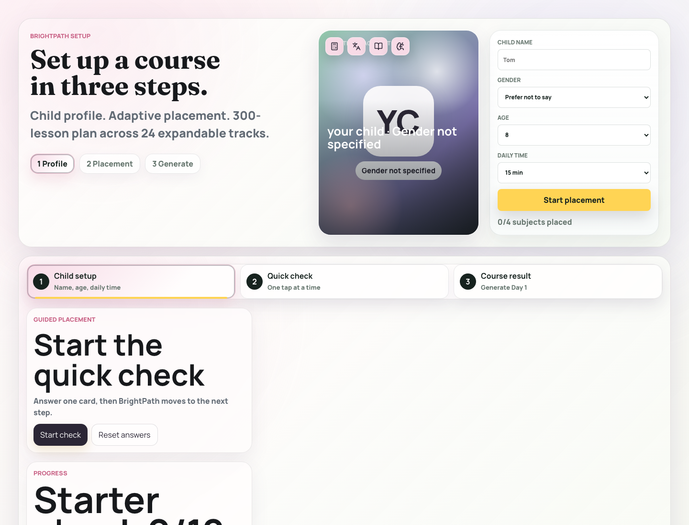
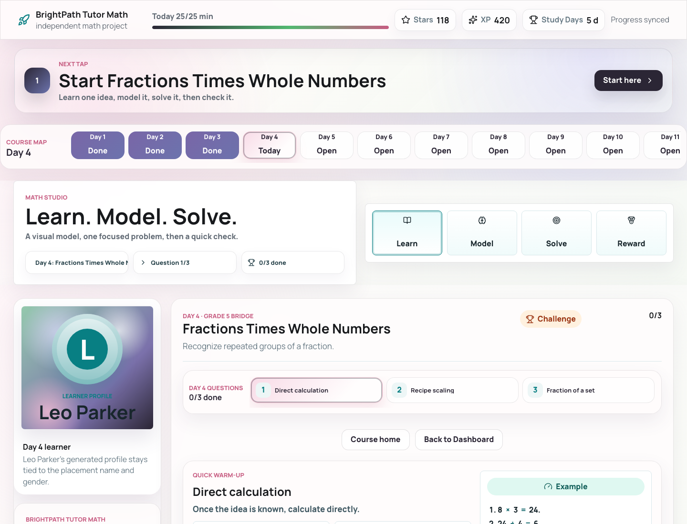

# BrightPath Learning OS

An open-source learning operating system for children: personalized course paths,
progress memory, review loops, rewards, parent dashboards, and privacy-safe
demo tenants.

BrightPath grew out of a private family learning system and is being generalized
into a reusable framework for families, educators, and builders who want more
than a generic homework chatbot.

## Why This Exists

General AI chat can answer questions, but children need structure:

- placement before instruction
- personalized course paths based on the child's real level
- daily guided lessons that feel made for the learner
- hints instead of answer dumping
- review loops for weak skills
- parent-visible progress
- small rewards tied to real learning completion
- strong separation between private child data and public demos

BrightPath is designed around that product loop.

The core idea is simple: a child should not be dropped into a fixed course just
because they are in a certain grade. BrightPath starts with a placement flow,
finds the learner's current level and focus areas, then assigns a course path
that feels personal. Each completed lesson can unlock stars, badges, gems, or
other rewards, making the system feel less like a worksheet site and more like
the child's own learning adventure.

## Demo Screenshots

The screenshots below use demo-safe learner data.

## Core Loop

1. A child completes a placement flow.
2. The system estimates the child's current level, strengths, and focus areas.
3. The system assigns a personalized course path from versioned curriculum.
4. The child works through daily guided lessons.
5. Mistakes and hard items are saved for review instead of blocking progress.
6. Completed learning unlocks small rewards that reinforce motivation.
7. Progress, rewards, and recommended next steps sync to a parent dashboard.
8. Demo tenants never see private child photos, voice clips, or progress.

## Current Modules

The private flagship implementation currently includes:

- English / ELA studio
- Math acceleration studio
- Mandarin / Chinese heritage studio
- AI literacy and coding studio
- Parent dashboard and QA hub

This public repository will extract the reusable framework, contracts, examples,
and demo-safe implementation patterns without publishing private family data.

## What Will Be Open-Sourced

- architecture contracts
- tenant and learner identity model
- progress API contract
- curriculum catalog patterns
- reward and review loop design
- demo-safe sample lessons
- Playwright-style regression scenarios
- privacy checks for public demo deployments
- Codex-assisted maintenance workflows

## What Will Not Be Open-Sourced

- private child photos
- private voice clips
- real learner progress
- family-specific course records
- deployment secrets
- private Vercel, KV, Redis, or Blob credentials
- any private school, family, or medical information

## Status

Early extraction. The private implementation exists across multiple Vite/React
apps. This repository is the clean public home for the reusable framework.

## License

Apache-2.0. See [LICENSE](./LICENSE).
